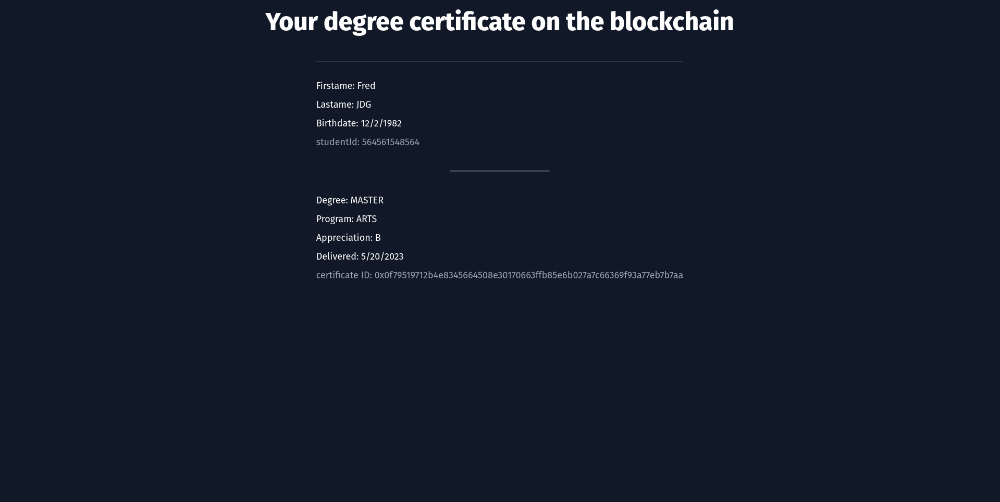
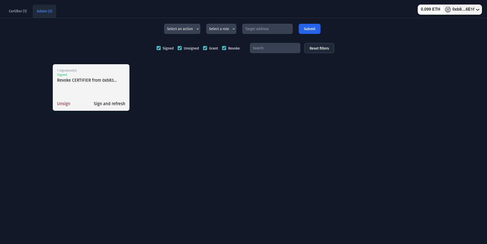
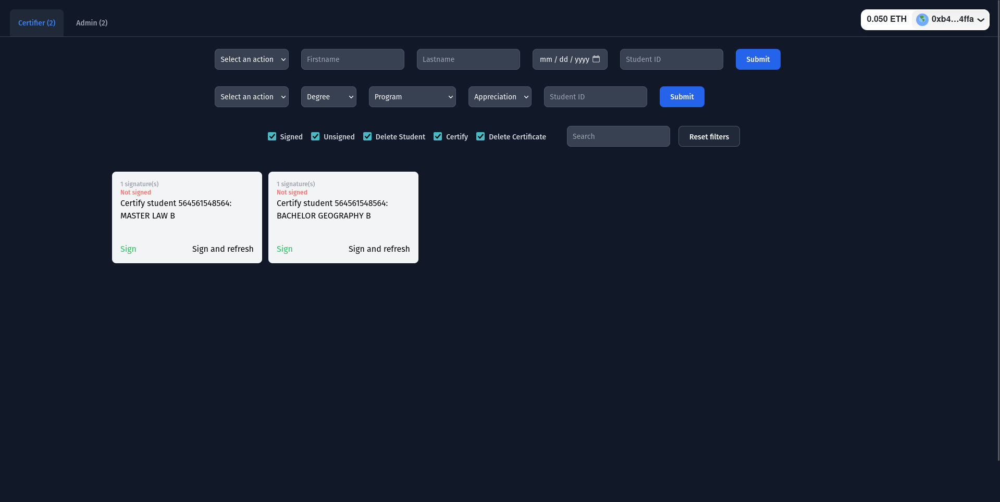
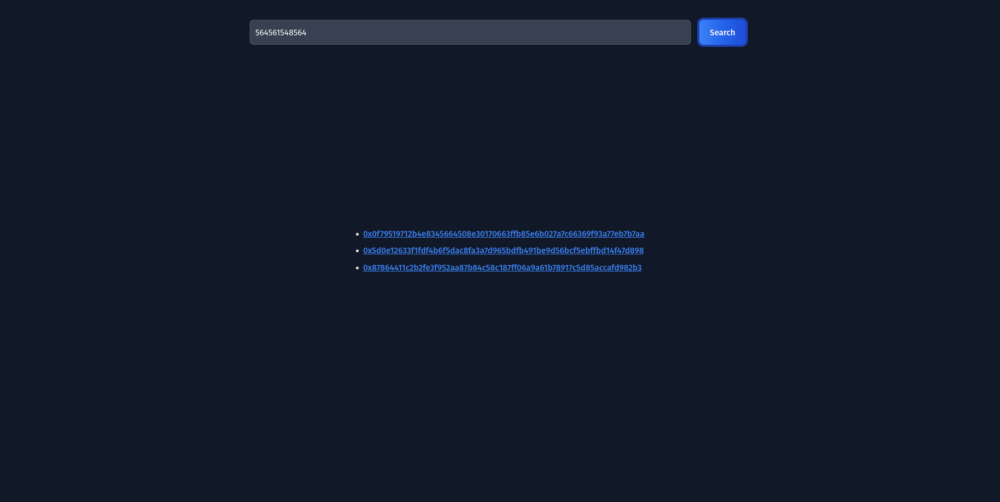

# Blockchain Degree Certificate DApp

The Blockchain Degree Certificate DApp is a decentralized application built on the Polygon zkEVM blockchain. It provides a secure and transparent platform for granting and managing degree certificates. The DApp utilizes Solidity smart contracts, OpenZeppelin for contract standardization and security, Next.js for the front-end interface, and Hardhat for local development and testing. Additionally, it leverages wagmi to interact with the smart contracts.

## Features

1. Role-Based Access Control:
   - The DApp includes a role-based access control system.
   - The `CERTIFIER_ADMIN` role is responsible for granting and revoking roles using multi-signature functionality.

2. Student and Certificate Management:
   - The `CERTIFIER` role allows users to create and delete student records.
   - Student records contain essential attributes such as ID, first name, last name, and birthdate.
   - Users with the `CERTIFIER` role can also create and delete certificates, including details such as appreciation, degree, program, and student ID.

3. Public Pages:
   - The DApp provides a user-friendly public page where anyone can enter a student ID to retrieve all their associated certificates.
   - Another page allows users to input a certificate ID and view its attributes.

4. Admin Panel:
   - An admin panel is available to authorized users.
   - The panel displays only the relevant tabs based on the user's role (CERTIFIER or ADMIN).
   - Users can conveniently view and manage ongoing multi-signature processes using filters and search options.

## Why Store Certificates on the Blockchain?

Storing certificates on the blockchain offers several advantages:

1. **Immutable and Tamper-Proof:** Certificates stored on the blockchain cannot be altered or manipulated, ensuring the authenticity and integrity of the records. This feature provides an additional layer of trust and eliminates the need for manual verification processes.

2. **Decentralized Verification:** With certificates stored on the blockchain, anyone can independently verify their authenticity without relying on centralized authorities or intermediaries. This enables faster and more efficient verification processes.

3. **Elimination of Counterfeit Certificates:** By leveraging the blockchain's transparency and immutability, the DApp reduces the risk of counterfeit certificates. The decentralized nature of the blockchain ensures that only authorized entities can issue valid certificates.

## DApp Information

- DApp URL: [https://certifications.ereynier.me](https://certifications.ereynier.me)
- Contract Address: [0xfd262387B87161138747692c72A5F47765cC79FD](https://testnet-zkevm.polygonscan.com/address/0xfd262387B87161138747692c72A5F47765cC79FD) (Polygon ZkEVM Testnet)

## Screenshots

Here are some screenshots of the DApp's user interface:

1. Certificate View:

2. Admin Panel - Role Granting:

3. Certifier - Certificate Creation:

4. Certificates for Student ID:

## License

This project is licensed under the [MIT License](LICENSE).

## Acknowledgements

We would like to express our gratitude to the developers and contributors of the following technologies, frameworks, and libraries that made this project possible:

- [Solidity](https://github.com/ethereum/solidity)
- [OpenZeppelin](https://github.com/OpenZeppelin/openzeppelin-contracts)
- [Next.js](https://github.com/vercel/next.js)
- [Hardhat](https://github.com/nomiclabs/hardhat)
- [wagmi](https://github.com/wagmi-dev/wagmi)

## Contact

For any inquiries or further information, please contact [ereynier.42@gmail.com](mailto:ereynier.42@gmail.com).
